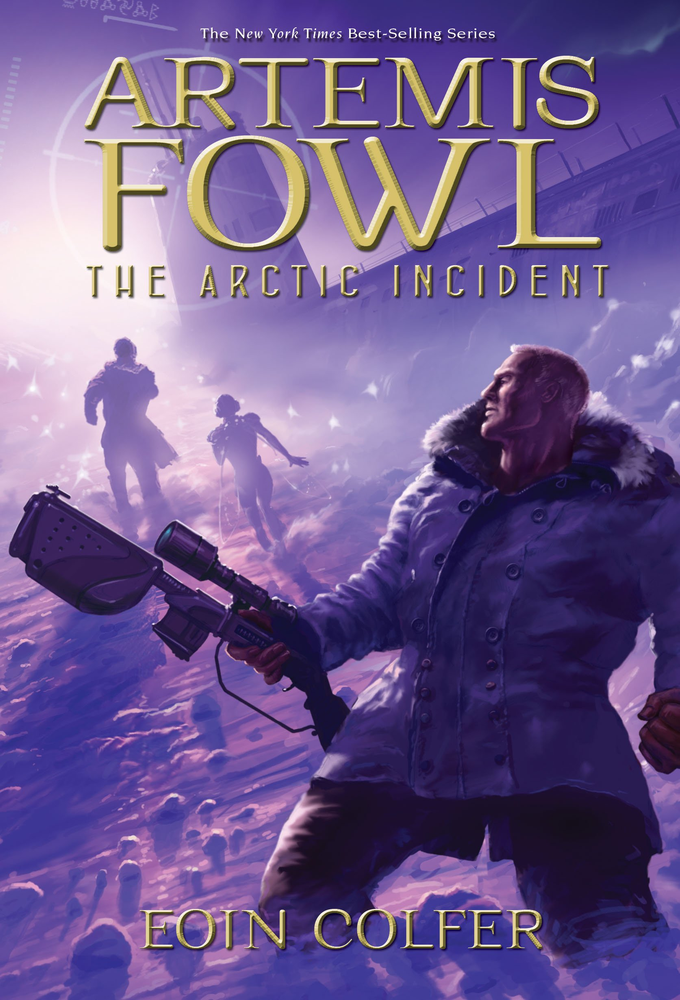
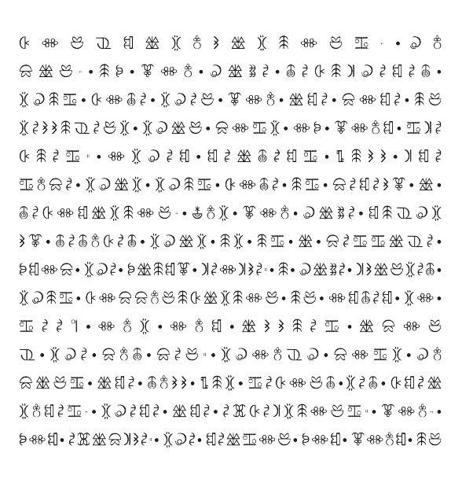
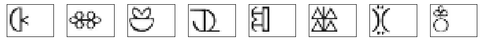

### Clustering-based automated reading and decryption of the fairy ciphertext in children's book _Artemis Fowl and the Arctic Incident_ by Eoin Colfer


This wonderful kids' series is fun not only for the stories themselves, but also because each of the first several books involves a cipher puzzle with "fairy hieroglyphics".  I love code puzzles!  

Originally in the first book the hieroglyphics were sequenced across the bottoms of the pages, and after manually decrypting a few pages with the key from the story it got tedious and I forgot about it for a while.  

But then I read my son the next book in the series in electronic form, where I discovered the hieroglyphic sequence was moved to the back of the book, all perfectly lined up in matrices over a few pages at the end.  And I thought, hey that seems like it'd be easy to parse and decrypt on a computer, just like the main character did.  


It has worked out moderately well so far.  My original plan was to use frequency-analysis and/or an iterative algorithm using dictionary comparison to auto-decrypt the glyphs (after they were converted to numbers) without the cipher key.  (Some refs I was looking at are <a href="http://cse.ucdenver.edu/~rhilton/docs/Cryptanalysis-Against-Monosub-Ciphers.pdf">this paper</a> and <a href="http://practicalcryptography.com/cryptanalysis/stochastic-searching/cryptanalysis-simple-substitution-cipher/#python-code">this python package</a>).  But before getting farther with that I've simply manually entered the key from the book.  The glyph recognition and parsing is still all automated, which is why the result isn't perfect at the end - in particular there remain some missing letters that were considered noise by the clustering; maybe some further tuning could improve that.  But it's enough to read the message!

Here's a docker container I found on DockerHub that made it easy to get the notebook going in jupyter:

```bash
docker run -v ~/Documents:/home/jovyan/work -p 8888:8888 jupyter/tensorflow-notebook:latest
```
  
And then you can just paste the `localhost:8888` browser link from the commandline into your browser.

The processing uses a simple approach to break up those matrices of glyphs into individual glpyhs of the same array size and placement:  


And then clustering on the image arrays parses the glyphs and transforms them into numerical arrays which can be cryptanalyzed or deciphered directly with a key, leading to the automated solution:  

```
"congratulations, human, if you have deciphered this code then you..."
```

Admittedly the contents may not be exactly literary or original, but certainly worth the fun of deciphering them!